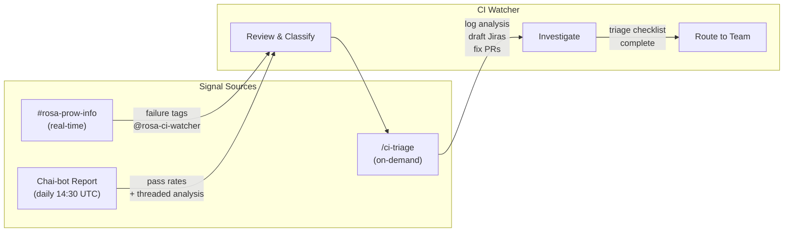
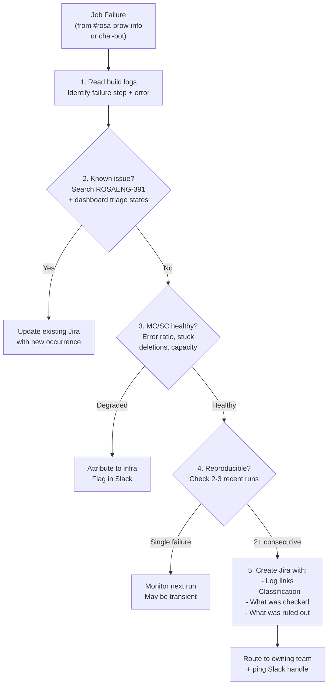

# CI Watcher Role and Responsibilities

## Overview

The CI Watcher is a **weekly rotating role, separate from on-call**, where one person per week is responsible for monitoring ROSA CI job health, triaging failures, and routing fixes to the owning team.

The role exists because CI failures need sustained attention (a week, not a sprint), paging creates expensive routing, and on-call has production incidents competing for attention.

## Key Principles

- **Triage within 24 hours** of a new failure appearing
- **Classify every failure** by category (infra flake, test bug, OCP payload, config drift, STS policy, cluster provisioning)
- **File or update Jira** for persistent failures (2+ consecutive fails)
- **Route to the owning team** with a clear description and reproduction steps
- **Block nothing.** The watcher observes, classifies, and routes
- **Investigate before routing.** The watcher must perform an initial triage of every failure before assigning it to another team or person. Read the build logs, check the failure category, verify MC/SC health, and confirm reproducibility. A ticket routed without investigation context is a ticket that bounces back. See the [Triage Before Routing](#triage-before-routing) section below for the full checklist

## What the Watcher Is NOT

- **Not on-call.** No paging, no SLA, no after-hours obligation
- **Not the fixer.** The owning team fixes. The watcher tracks
- **Not a router without context.** The watcher never forwards a failure to another team without first performing a minimal investigation and documenting findings
- **Not a bottleneck.** If the watcher is out, the rotation skips to the next person

## Signal Sources

The watcher has three signal sources that work together:

1. **[#rosa-prow-info](https://redhat-internal.slack.com/archives/C0AT31ERJLS)** (real-time): Prow bot posts every job result as it completes. Failures tag `@rosa-ci-watcher` immediately.
2. **Chai-bot daily health report** (daily summary): Posted to [#wg-rosa-cicd](https://redhat-internal.slack.com/archives/C0ADGRNAT8U) at 14:30 UTC with per-category pass rates, trends, and detailed failure analysis in threaded replies (up to 5 jobs).
3. **`/ci-triage`** (on-demand analysis): Covers all tracked jobs, performs deep log analysis, classifies root causes, drafts Jira stories, and proposes fix PRs. Picks up where chai-bot leaves off.

## Daily Responsibilities

| Step | Task | Tool |
|------|------|------|
| 1 | Review the chai-bot daily health report posted to [#wg-rosa-cicd](https://redhat-internal.slack.com/archives/C0ADGRNAT8U) (14:30 UTC). This is your starting point for the day's triage. Note any new failures or trend changes in the category pass rates. | Slack |
| 2 | Check [#rosa-prow-info](https://redhat-internal.slack.com/archives/C0AT31ERJLS) for overnight failure notifications. Red builds tag `@rosa-ci-watcher`. Cross-reference with the chai-bot report to identify anything the daily report didn't cover. | Slack |
| 3 | Run `/ci-triage` to get automated status, failure diagnosis, and proposed actions | Claude Code |
| 4 | Check CI MC/SC health (error cluster ratio, stuck deletions) | OCM CLI / backplane |
| 5 | Check ROSA stage environment health. If stage is unhealthy, CI will be degraded, and failures should be attributed to stage, not tests. | OCM CLI / Sippy SLO dashboard |
| 6 | Review `/ci-triage` findings against [Sippy rosa-stage dashboard](https://sippy.dptools.openshift.org/sippy-ng/release/rosa-stage) | Sippy |
| 7 | For any failures the AI could not classify, investigate root cause manually. For cluster provisioning failures, capture the cluster ID and pull ServiceLogs and CS event logs for agentic root cause analysis. | Prow GCS / OCM CLI |
| 8 | Update the **Triage** column on the [CI Health dashboard](https://rosa-eng-dashboard.apps.engineering.openshift.org/executive#ci-health) for each category you're investigating. Set "Under Investigation" as soon as you start, then update as the investigation progresses (Root Cause Identified, Fix In Progress, etc.). Skip categories already being triaged by their owning team. | rosa-eng-dashboard |
| 9 | Review and approve any Jira stories or fix PRs proposed by `/ci-triage` | Jira / GitHub |
| 10 | File or update Jira for anything `/ci-triage` missed | Jira ([ROSAENG-391](https://redhat.atlassian.net/browse/ROSAENG-391)) |
| 11 | Post daily status update as a reply to the chai-bot daily health report thread in [#wg-rosa-cicd](https://redhat-internal.slack.com/archives/C0ADGRNAT8U). Include triage findings, PRs filed, and any failures routed to other teams. | Slack |

The chai-bot daily health report and [#rosa-prow-info](https://redhat-internal.slack.com/archives/C0AT31ERJLS) notifications are the watcher's primary signal sources. Chai-bot provides both a high-level summary (per-category pass rates, trends) and detailed failure analysis in threaded replies for the worst-performing jobs (up to 5). [#rosa-prow-info](https://redhat-internal.slack.com/archives/C0AT31ERJLS) provides real-time individual job results. The `/ci-triage` skill picks up where chai-bot leaves off: it covers all tracked jobs (not just the top 5), and goes beyond analysis to action by drafting Jira stories, proposing fix PRs, and shepherding open changes. Together, these three sources give the watcher a complete picture before manual investigation begins.

The watcher reviews the AI's output, approves or corrects the classifications, and handles the 20% of cases that require human judgment (org context, escalation decisions, cross-team routing).

## Weekly Cadence

| Day | Task |
|-----|------|
| Monday | Slack Workflow tags the incoming watcher. Check the [CI Health dashboard](https://rosa-eng-dashboard.apps.engineering.openshift.org/executive#ci-health) triage states for anything in progress from last week, then start the daily triage procedure. |
| Mon-Thu | Daily triage: review chai-bot report, check [#rosa-prow-info](https://redhat-internal.slack.com/archives/C0AT31ERJLS), run `/ci-triage`, review findings, approve/correct, update dashboard triage states, post status. Shepherd open PRs. |
| Friday | Slack Workflow tags the outgoing watcher. Verify all open failures have Jiras, triage states on the dashboard are current, and open PRs have reviewers. |

## Triage Before Routing

**The watcher must perform an initial triage of every failure before routing it to another team or person.** Routing without investigation is the single biggest waste of time in CI triage. It creates ping-pong between teams, delays fixes, and erodes trust in the watcher role.

Before assigning any failure to another team, the watcher must:

1. **Read the build logs.** Open the Prow log link from [#rosa-prow-info](https://redhat-internal.slack.com/archives/C0AT31ERJLS) or the chai-bot report and identify the failure point (which step failed, what error message appeared).
2. **Check if it's a known issue.** Search existing Jira ([ROSAENG-391](https://redhat.atlassian.net/browse/ROSAENG-391) children) and check the CI Health dashboard triage states for the same failure pattern.
3. **Verify MC/SC health.** A degraded management cluster produces cascading failures that look like individual test bugs. Check error cluster ratio, stuck deletions, and capacity before blaming a test.
4. **Confirm reproducibility.** Check at least 2-3 recent runs. A single failure may be genuine infrastructure noise; 2+ consecutive failures indicate a real issue.
5. **Document findings in the Jira ticket.** When routing, the ticket must include: failure logs link, failure classification, what the watcher checked, and what they ruled out.

**How routing works in practice:**
1. The watcher creates (or updates) a Jira story under ROSAENG-391 with the triage context above.
2. The watcher reassigns the Jira to the appropriate team's project or component (see the [classification matrix](escalation-paths.md#classification-matrix) for routing targets).
3. The watcher pings the owning team's Slack handle with a link to the Jira and a one-line summary.
4. For high-priority failures (conformance, multi-category), the watcher follows up within 48 hours if there's no response.

## Communication

- Post daily status updates as replies to the chai-bot thread in [#wg-rosa-cicd](https://redhat-internal.slack.com/archives/C0ADGRNAT8U)
- Monitor [#rosa-prow-info](https://redhat-internal.slack.com/archives/C0AT31ERJLS) for real-time failure notifications
- Escalate critical/blocking issues in [#wg-rosa-cicd](https://redhat-internal.slack.com/archives/C0ADGRNAT8U)
- Use `@rosa-ci-watcher` Slack alias for cross-team coordination
- Before EOB Friday: verify triage states and Jiras are current for shift transition

## Anti-Patterns

- **Do not route without triaging first.** Every ticket sent to another team must include: the build log link, what failed, what you checked, and what you ruled out. "This job failed, please look" is not a triage. It's a forwarded email
- **Do not dismiss failures as "flaky" and retrigger.** Every failure has a root cause. Find it
- **Do not increase timeouts to mask infrastructure problems.** Longer timeouts degrade pipelines without surfacing the real issue
- **Do not leave cluster profiles in a "no test" state.** Private clusters, external auth, and other profiles that consistently fail need investigation, not skip-listing
- Do not page on-call for a red nightly
- Do not self-lgtm PRs authored by your own fork. Ask a reviewer
- Prefer fixing the root cause (PromQL, test assertion, config) over skip-listing. Only skip with a tracked upstream bug
