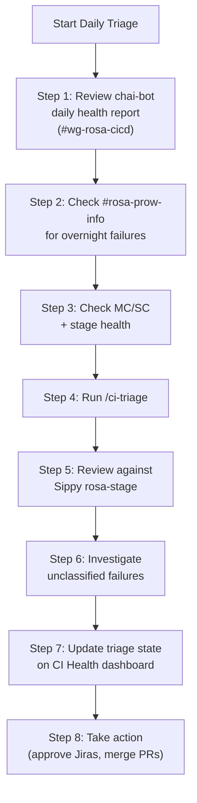
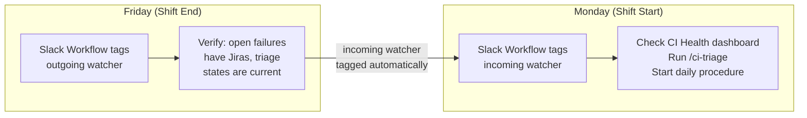

# CI Watcher Runbook

## Jobs Under Surveillance

All configured periodic jobs can be found in [CI Status jobs](https://github.com/openshift-online/rosa-e2e/blob/main/configs/ci-status-jobs.yaml). The jobs are organized into the following categories:

| Category | Description | Jobs |
|----------|-------------|------|
| ROSA E2E | Managed service validation (HCP, Classic STS, OSD GCP, Upgrade) | [Prow Periodic](https://prow.ci.openshift.org/?type=periodic&job=periodic-ci-openshift-online-rosa-e2e-main-periodics*), [Prow Upgrade](https://prow.ci.openshift.org/?type=periodic&job=periodic-ci-openshift-online-rosa-e2e-main-upgrade*) |
| OCM FVT | Clusters-service API contract tests (HCP, Classic, OSD GCP across staging and integration) | [Prow location](https://prow.ci.openshift.org/?type=periodic&job=periodic-ci-openshift-online-rosa-e2e-main-ocm-fvt*) |
| OCP Conformance | openshift-tests run against ROSA HCP and Classic STS clusters on each OCP nightly | [Prow location](https://prow.ci.openshift.org/?job=periodic-ci-openshift-release-main-nightly*rosa*) |

## Daily Triage Procedure



### Step 1: Review Chai-Bot Daily Health Report

The chai-bot (SHIP) posts an automated CI health report to [#wg-rosa-cicd](https://redhat-internal.slack.com/archives/C0ADGRNAT8U) every weekday at 14:30 UTC (7:30 AM Pacific), 30 minutes after the Prow status job completes. This is your starting point for the day's triage.

Review the report for:
- Per-category pass rates and trends (ROSA E2E, OCM FVT, HCP Conformance, Classic STS Conformance)
- New failures and regressions highlighted since the previous report
- Deep failure analysis in threaded replies (up to 5 jobs)

All daily triage updates should be posted as replies to the chai-bot thread, keeping the day's CI discussion consolidated in one place.

### Step 2: Check #rosa-prow-info

Check [#rosa-prow-info](https://redhat-internal.slack.com/archives/C0AT31ERJLS) for overnight failure notifications. The Prow bot posts every job completion (green or red) with a direct link to logs. On failures, the bot tags `@rosa-ci-watcher` so you're notified immediately.

Cross-reference with the chai-bot report to identify anything the daily report didn't cover (e.g., failures that occurred after the report was generated).

### Step 3: Check MC/SC and Stage Health

Before triaging individual failures, check the health of the CI infrastructure:

- **MC/SC health**: Error cluster ratio, stuck deletions, developer HCPs consuming capacity
- **ROSA stage environment health**: If stage is unhealthy, CI will be degraded. Attribute failures to stage rather than individual tests.
- **ROSA Engineering Dashboard**: Check [rosa-eng-dashboard](https://rosa-eng-dashboard.apps.engineering.openshift.org/executive#ci-health) for a consolidated view of CI health, component deployment status, and release readiness.

If a MC is degraded, flag it immediately in [#wg-rosa-cicd](https://redhat-internal.slack.com/archives/C0ADGRNAT8U) and circuit-break further test triage until the MC is healthy.

### Step 4: Run /ci-triage

```
/ci-triage
```

**How /ci-triage complements chai-bot:**

Chai-bot provides both a high-level summary (per-category pass rates, trends) and detailed failure analysis in threaded replies for the worst-performing jobs (up to 5). It runs automatically every day, giving the watcher a ready-made briefing.

`/ci-triage` picks up where chai-bot leaves off: it covers **all** tracked jobs (not just the top 5), and it goes beyond analysis to **action**. It drafts Jira stories for persistent failures, proposes fix PRs for test bugs and config drift, and shepherds open PRs. Where chai-bot tells you "this job has been failing for 3 days with this error", `/ci-triage` creates the Jira, writes the fix, and opens the PR.

Use chai-bot's detailed findings to focus `/ci-triage`: if chai-bot's thread highlights a specific root cause pattern, tell `/ci-triage` to prioritize that category. If chai-bot shows a trend (declining pass rate over several days), `/ci-triage` can correlate across multiple runs to find the introducing change.

This spawns a team of 4 background agents:

| Agent | Role |
|-------|------|
| status-checker | Polls all tracked jobs, reports state changes |
| log-analyzer | Deep-dives into specific failures on demand |
| fix-proposer | Creates fix PRs for test bugs and config drift |
| jira-implementer | Creates Jira stories, shepherds open PRs |

Wait for agent reports to complete before proceeding.

### Step 5: Review Against Sippy

Open the [Sippy rosa-stage dashboard](https://sippy.dptools.openshift.org/sippy-ng/release/rosa-stage) and cross-reference with `/ci-triage` findings. Look for:
- Jobs showing declining pass rates over multiple days
- New failures that appeared overnight
- Jobs with no recent data (may indicate a config or infra problem)

Also check the ROSA Engineering Dashboard for additional context:
- [CI Health](https://rosa-eng-dashboard.apps.engineering.openshift.org/executive#ci-health) — consolidated CI job health and pass rate trends
- [Delivery](https://rosa-eng-dashboard.apps.engineering.openshift.org/delivery) — component deployment status across environments, useful for correlating CI failures with recent promotions

### Step 6: Investigate Unclassified Failures

For any failures `/ci-triage` could not classify:
1. Navigate to the job in [Prow](https://prow.ci.openshift.org/)
2. Pull the build logs from GCS: `storage.googleapis.com/test-platform-results/logs/<job-name>/<build-id>/`
3. Key files to check: `finished.json`, `build-log.txt`, step artifacts
4. For cluster provisioning failures, capture the cluster ID and pull ServiceLogs and CS event logs for root cause analysis
5. Classify the failure using the [classification matrix](escalation-paths.md#classification-matrix)

### Step 7: Update Triage State on CI Health Dashboard

As you investigate failures, update the **Triage** column on the [CI Health dashboard](https://rosa-eng-dashboard.apps.engineering.openshift.org/executive#ci-health) for each affected category. This gives the whole team real-time visibility into what the watcher is actively working on.

Available triage states:

| State | When to set |
|-------|-------------|
| Under Investigation | You've started looking at failures in this category |
| Root Cause Identified | You know why it's failing but haven't fixed it yet |
| Infra Flake | Failures are caused by CI infrastructure issues, not test or code bugs |
| Upstream Bug | Failures caused by an OCP regression, tracked via OCPBUGS-* |
| Fix In Progress | A fix PR is open and being shepherded |
| Fix Merged | The fix has merged and you're waiting for the next run to confirm |

Set the triage state as early as possible ("Under Investigation" as soon as you start looking). Update it as the investigation progresses. Clear it back to "--" once the category is healthy again.

**Category ownership determines who triages.** The three on-shift ICs each own specific categories based on their sub-pillar. Categories outside the watcher rotation are owned by other teams and should be skipped unless they're unattended.

| Category | Owned By | On-Shift IC Action |
|----------|----------|-------------------|
| ROSA E2E STG | Any on-shift IC | Triage directly |
| SRE Operator E2E | Any on-shift IC | Triage directly |
| HCP Conformance | Trust Engineering IC | Trust IC triages (TRT-facing, fastest response) |
| Classic STS Conformance | Trust Engineering IC | Trust IC triages (TRT-facing, fastest response) |
| OCM FVT HCP/Classic/GCP STG | Service Engineering IC | Service Engineering IC triages |
| GAP E2E | Production Engineering IC | Production IC triages |
| ROSA CLI E2E | Service Engineering (ROSA CLI) | Skip if triage state already set, otherwise flag in [#wg-rosa-cicd](https://redhat-internal.slack.com/archives/C0ADGRNAT8U) |
| ROSA TF E2E | Service Engineering (TF) | Skip if triage state already set, otherwise flag |
| CAPA E2E | Service Engineering (CAPA) | Skip if triage state already set, otherwise flag |

For categories outside the watcher rotation (ROSA CLI, ROSA TF, CAPA): if the triage state is "--" and the pass rate is below threshold, ping the owning team in [#wg-rosa-cicd](https://redhat-internal.slack.com/archives/C0ADGRNAT8U) to ask if they're aware. Do not set the triage state for their category unless they ask you to.

### Step 8: Take Action

- Review and approve Jira stories proposed by `/ci-triage`
- Review and merge fix PRs (request a reviewer — do not self-lgtm)
- File Jira under [ROSAENG-391](https://redhat.atlassian.net/browse/ROSAENG-391) for anything the AI missed

## Shift Transitions

Shift transitions are lightweight. There is no handover document. The CI Health dashboard triage states, open Jiras under [ROSAENG-391](https://redhat.atlassian.net/browse/ROSAENG-391), and the chai-bot thread history already capture all the context the incoming watcher needs.



**Monday (Shift Start):** A Slack Workflow message tags the incoming watcher in [#wg-rosa-cicd](https://redhat-internal.slack.com/archives/C0ADGRNAT8U) with:

- Links to: [CI Health dashboard](https://rosa-eng-dashboard.apps.engineering.openshift.org/executive#ci-health), [Delivery dashboard](https://rosa-eng-dashboard.apps.engineering.openshift.org/delivery)
- Checklist:
  - [ ] Check CI Health dashboard triage states for anything in progress from last week
  - [ ] Check [#rosa-prow-info](https://redhat-internal.slack.com/archives/C0AT31ERJLS) for any weekend failures
  - [ ] Review open Jiras under [ROSAENG-391](https://redhat.atlassian.net/browse/ROSAENG-391) for active investigations
  - [ ] Run `/ci-triage` to get current status
  - [ ] Check if any open PRs from last week need review or retest

**Friday (Shift End):** A Slack Workflow message tags the outgoing watcher with:

- Checklist:
  - [ ] All open failures have Jiras under [ROSAENG-391](https://redhat.atlassian.net/browse/ROSAENG-391)
  - [ ] Triage states on the CI Health dashboard are current (not stale from earlier in the week)
  - [ ] Open PRs have reviewers assigned
  - [ ] No un-acked failures in [#rosa-prow-info](https://redhat-internal.slack.com/archives/C0AT31ERJLS)
  - [ ] Any blocked investigations have the blocker noted in the Jira
- The incoming watcher is tagged automatically

## Common Scenarios

### Conformance Job Turns Red

1. Check if `/ci-triage` already caught and classified the failure
2. If it's an OCP regression (test passes on prior nightly, fails on new one), file an upstream OCPBUGS-\* bug and add a temporary skip with a link to the bug
3. If it's a ROSA-side issue (cluster provisioning, STS policy, config drift), route to the appropriate ROSA team
4. Ack within 4 business hours in the reporting channel
5. If unresolved after 24 hours, escalate via WebRCA and bring in the relevant teams

### MC/SC Appears Degraded

1. Flag immediately in [#wg-rosa-cicd](https://redhat-internal.slack.com/archives/C0ADGRNAT8U)
2. Circuit-break further test triage until MC is healthy
3. Attribute individual test failures on a degraded MC to the infrastructure issue
4. Related: [OCM-23872](https://redhat.atlassian.net/browse/OCM-23872) tracks making dev SCs/MCs healthy to reduce CI noise

### Cluster not ready due to readiness check failure

1. Flag immediately in [#wg-rosa-cicd](https://redhat-internal.slack.com/archives/C0ADGRNAT8U)
2. Identify the component which is blocking the cluster readiness check
3. Fix the problem to unblock the tests if issue identified
4. Find the owner team of the component as high priority if the fix is not obvious
